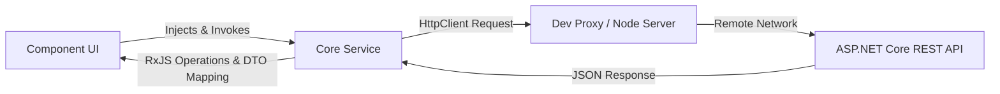

# API Communication & Data Flow Guide

This document describes how the Angular Clinic Staff Dashboard interacts with the backend HTTP REST API, handles DTO mapping, configures local dev proxies, and recovers from network errors.

---

## 1. API Architecture

All HTTP communications are encapsulated inside service classes located in `src/app/core/services/`. Components never trigger HTTP requests directly; they interact through service layer boundaries:



---

## 2. Dev Server Proxy Configuration

To prevent Cross-Origin Resource Sharing (CORS) errors during local development, the CLI dev server uses a routing proxy:
- **File**: `proxy.conf.json` (or inline angular configuration).
- **Behavior**: Intercepts requests prefixing `/api` on `localhost:4200` (or `4321`) and forwards them transparently to the remote backend service: `https://api.clinic.kaessam.codes`.
- **Target Setting**:
  ```json
  {
    "/api": {
      "target": "https://api.clinic.kaessam.codes",
      "secure": false,
      "changeOrigin": true
    }
  }
  ```

---

## 3. RxJS Pipelines & DTO Mappings

Services use RxJS operator pipes to handle deserialization anomalies and clean up payloads before they reach components:

### Paged Response Mapping
If a backend endpoint returns a paged object (`{ items: T[], total: number }`) where the component expects a clean list, the service maps it in flight:
```typescript
getAll(): Observable<DoctorListItemDto[]> {
  return this.http.get<any>(`${API_BASE_URL}/doctors`).pipe(
    map(res => Array.isArray(res) ? res : (res?.items || []))
  );
}
```

### Timezone-Safe Date Queries
Dates passed to API queries (e.g. appointment date calendar filters) are formatted timezone-safely without timezone offsets by extracting the date portion at local noon, avoiding midnight shifts:
`const dateParam = filterDate().split('T')[0];`

---

## 4. Error Handling Pipeline

HTTP requests are routed through standard RxJS catch blocks to format server errors:
- **Toast Notifications**: Injected `ToastService` triggers error notifications for validation messages returned by endpoints (e.g., `400 Bad Request` or `409 Conflict`).
- **Null Safety Fallbacks**: Services use `catchError(() => of([]))` in parallel query chains (like weekly grid loads) to ensure that a single day failure does not freeze other days on the display.

---

## 5. Developer Onboarding Notes

> [!IMPORTANT]
> **Use Model Interfaces**: Always type HTTP response payloads (e.g., `this.http.get<AppointmentDto>(...)`). Do not use the `any` type unless performing a transitional mapping check.
> **Configure API Base URL**: The API base URL is specified inside `src/app/core/config.ts`. During deployment, check that this maps to the correct staging or production domain.
