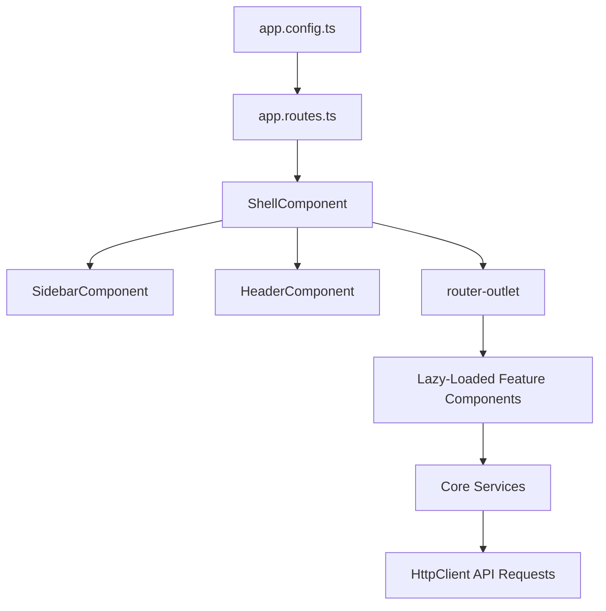
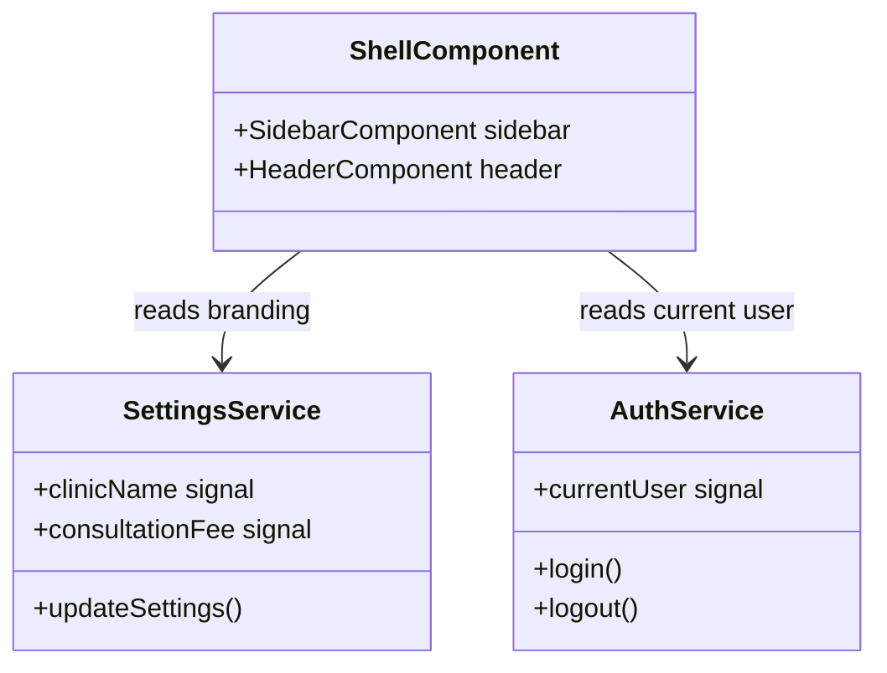

# System Architecture Guide

This document describes the high-level architecture, design patterns, and engineering choices of the Clarity Clinic Staff Dashboard.

---

## 1. Architectural Overview

The application is built using **Angular 19** and adheres to modern Angular architecture best practices:
- **Standalone Components**: Eliminates NgModules to simplify dependency declaration and load times.
- **Signals-Driven State**: Reactive state tracking using Angular Signals (`signal`, `computed`, `effect`) for fine-grained change detection.
- **Stepped Layout Shell**: Features are rendered inside a centralized layout structure containing a responsive sidebar, header, and content canvas.

---

## 2. Core Architectural Patterns

### Standalone Component Architecture
Every page, layout wrapper, and shared element is configured as a standalone component (`standalone: true`). Shared pipes, directives, and components are declared directly in the component's `imports` array, facilitating modularity and testing.

### Reactive State Management (Signals)
Rather than relying on heavy global state stores (like NgRx), this dashboard implements lightweight, Signals-driven singleton services:
- **Singleton Services**: State is held in services (`SettingsService`, `AuthService`) using read-only Signals exposed via public getters.
- **Computed Derivations**: Components use `computed` properties to automatically derive states (e.g. `weekDays` or `selectedDateLabel`), ensuring they update immediately when dependencies change.
- **Reactive Effects**: `effects` are used to sync state changes back to external systems (e.g. updating document titles when clinic name settings change).

### Unidirectional Data Flow
Components strictly receive inputs (`@Input`) and emit actions (`@Output`) or read from services. UI updates follow a unidirectional flow, preventing cycles and making components easier to debug.

---

## 3. Important Architectural Files

- **[`main.ts`](file:///c:/Users/hp/Desktop/frontend%20projects/clinic/src/main.ts)**: Application bootstrap entry point.
- **[`app.config.ts`](file:///c:/Users/hp/Desktop/frontend%20projects/clinic/src/app/app.config.ts)**: Configures global dependency injection providers, routing, and HTTP interceptors.
- **[`app.routes.ts`](file:///c:/Users/hp/Desktop/frontend%20projects/clinic/src/app/app.routes.ts)**: Defines lazy-loaded page route structures, security guards, and data titles.

---

## 4. Key Relationships

---

## 5. Developer Onboarding Notes

> [!IMPORTANT]
> **No Global Component States**: Do not store state directly in components if other components need to access it. Elevate it to a core service.
> **Avoid Direct Feature Imports**: Components in one feature (e.g., `WalkInComponent`) must never directly import components from another feature (e.g., `CalendarComponent`). All communication must go through core services or routing parameters.
