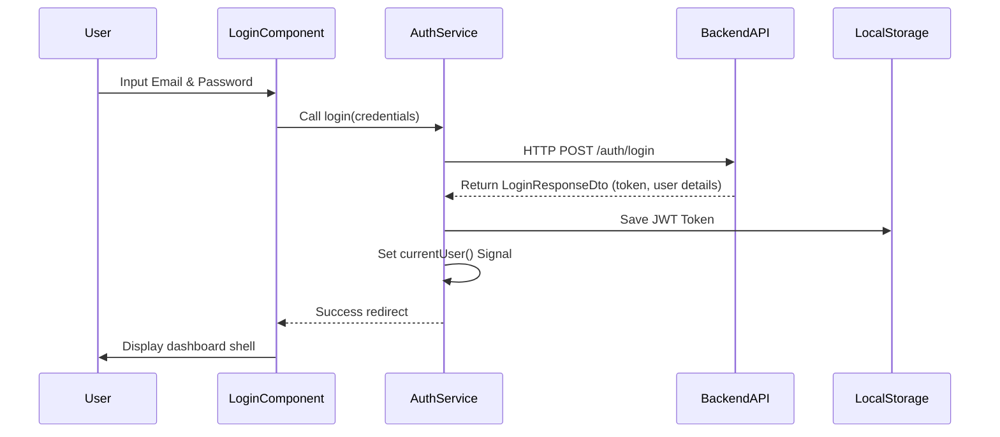

# Authentication & Authorization Guide

This guide details the security pipeline, JWT token management, route guards, and role-based access controls (RBAC) in the Clarity Clinic Staff Dashboard.

---

## 1. Authentication Flow

The dashboard uses a JWT token-based authentication mechanism:



---

## 2. Guard Protection Pipeline

To restrict pages from unauthorized access, route definitions in `app.routes.ts` are bound to two functional guards:

### 1. `authGuard`
- **Purpose**: Verifies that a user is currently logged in.
- **Mechanism**: Checks `authService.isAuthenticated()`. If false, intercepts navigation and redirects the user to the `/login` page while returning `false`.
- **Implementation**: Located in `src/app/core/guards/auth.guard.ts`.

### 2. `roleGuard`
- **Purpose**: Enforces Role-Based Access Control (RBAC).
- **Mechanism**: Expects an array of allowed roles passed in route `data` (e.g. `['Admin', 'Receptionist']`). Reads the user's role from `AuthService.currentUser()`. If the role does not match, redirects to the home route.
- **Implementation**: Located in `src/app/core/guards/role.guard.ts`.

---

## 3. JWT Token Interceptor

All API calls must contain the security token. Rather than manually injecting headers in every service, the application registers an HTTP interceptor:
- **Location**: `src/app/core/interceptors/auth.interceptor.ts` (configured as a provider function).
- **Behavior**: Intercepts outbound HTTP requests. If a JWT token is saved in `localStorage`, clones the request and appends the header: `Authorization: Bearer <token>`.
- **Error Handling**: If any response returns HTTP `401 Unauthorized`, it automatically triggers a logout to clear expired credentials and forces a login redirect.

---

## 4. State Signals in AuthService

The `AuthService` exposes key signals for reactive UI rendering:
- **`currentUser`**: Reads decoded JSON payloads of the logged-in user (id, name, email, role).
- **`isAuthenticated`**: Derived computed signal (`computed(() => !!this.currentUser())`) checking if a valid profile is loaded.

---

## 5. Developer Onboarding Notes

> [!IMPORTANT]
> **Check Token Decryption Issues**: If the backend starts encrypting user attributes inside token payloads differently, update the parsing logic inside `AuthService.decodeToken()`.
> **Checking Roles in Components**: To show or hide elements in templates based on role authorization, do not inject custom logic. Inject `AuthService` and bind conditional directives directly to the current user's role:
> ```html
> <app-button *ngIf="authService.currentUser()?.role === 'Admin'">
>   Admin Settings
> </app-button>
> ```
